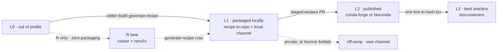

# biopixi

**A conformance profile for `pixi.toml` — a deliberately small subset — plus the tooling to
build environments and containers from it, and to grade it.**

Reproducible is not the same as transferable. A `pixi.toml` with a path dependency and a
committed `pixi.lock` is *fully* reproducible and *completely* non-transferable outside the repo
that holds it. pixi gets reproducibility right; it has no opinion about how far the result
travels, or about containers, or about whether your dependencies are something a stranger could
install at all. biopixi is about the part reproducibility does not imply: **durability and
transferability**.

The profile is small on purpose. pixi is a large, general tool; biopixi says which slice of it
carries a guarantee, and grades any given manifest against that slice. Nothing here replaces
pixi, conda, rattler-build, mulled, or Wave — biopixi is metadata and policy that **calls out to
those tools**. It never installs anything itself. It is not a package manager and will never
become one.

Two verbs. **`grade`** is pure: static analysis of a manifest, no external tools, safe to run in
CI or a pre-commit hook. **`build`** does the heavy lifting and shells out — pixi for
environments, rattler-build for recipes, mulled-build or Wave for containers. Keeping grading
dependency-free means a contributor can learn where they stand without installing a toolchain.

The through-line is a bridge. pixi is excellent at development and local environments — fast
solves, a real lockfile, task running — which is deliberately not what mulled and Wave are for:
those publish and distribute, and say nothing about how you work day to day. Neither side is
lacking; nothing joins them. biopixi is the on-ramp from a working `pixi.toml` to conda-forge,
bioconda, BioContainers, and the Galaxy tool ecosystem — each step of that journey named,
gradeable, and worth taking on its own.

## Readiness Levels

A manifest earns **L0–L3**. The levels are not degrees of reproducibility — they measure how
ready an environment is to leave your hands, and each rung **removes something that must still
exist** for the environment to be rebuilt. L1 needs your repository, a public channel, and a
local toolchain. L2 drops the repository. L3 drops the channel, because the artifact is a
container distributed across independently operated infrastructure. Every cell below is mechanically decidable
from the manifest plus public metadata — no judgement calls, which is what makes `grade` a static
tool rather than a review checklist.

| | **L0** out of profile | **L1** packaged locally | **L2** published | **L3** best practice |
|---|---|---|---|---|
| **rebuild requires** | — | this repo **+** public channels **+** a local toolchain | public channels | any *one* of several mirrors |
| **breaks when** | — | the repo is lost | the channel dies | everything dies at once |
| in profile | **no** | yes | yes | yes |
| expressible as | — | path dependency | version spec | version spec |
| `environment.yml` derivable | no | no | **yes** | yes |
| reuse reach | — | this repo only | anyone with conda | anyone, pre-built |
| in a community-maintained channel | no | no | **yes** | yes |
| containerizable via mulled | — | **yes**, against a local channel | yes | already built |
| containerizable via Wave | — | **no** — cannot see a local channel | **yes**, `--freeze` | redundant |
| mulled name computable offline | — | **yes** | yes | yes |
| image published / mirrored | — | no, local only | you push, or Wave hosts | **quay + depot + CVMFS + TACC** |
| who carries r-base migrations | — | **us** | upstream bots | upstream bots |
| ongoing cost | — | recipe upkeep | none | none |

**A manifest's level is the minimum level of its packages.** One unpublished dependency holds
the whole environment at L1, the same way one unobtainable tool caps a pipeline. The level is
therefore *derived, never declared*.



## How the container gets made

**L1** — mulled tooling against the local build output. Same machinery BioContainers uses:

```bash
rattler-build build --recipe recipes/r-designit/recipe.yaml   # -> output/
rattler-index fs ./output
mulled-build build -c file://$PWD/output,conda-forge,bioconda 'r-designit=0.5.0'
```

Produces the same `mulled-v2` name a published build would, computable offline. Not pushed
anywhere — and it must not be, see Gotchas.

**L2** — drop the `file://` entry and anyone reproduces it from public channels. Or, with no
local toolchain at all:

```bash
wave --conda-package r-designit=0.5.0 --freeze --await
```

**L3** — nothing to build. `docker pull quay.io/biocontainers/mulled-v2-<hash>:<tag>`, or
Singularity from `depot.galaxyproject.org`.

## Wave and mulled are both kept, deliberately

They fail in opposite places.

| | Wave | mulled-* |
|---|---|---|
| local prerequisites | one static binary + network | conda **+** Docker **+** involucro |
| built for | a developer who wants a container | BioContainers/Galaxy CI and channel maintenance |
| L1 (local channel) | **blind** — remote service, cannot read `file://` | **works** |
| L2 (published) | one call, hosted, deterministic | works, but you host the result |
| name computable offline | no — service round-trip | **yes**, `mulled-hash` |

Wave is the better ergonomic default and the right reach at L2. mulled is the only thing that
works at L1 and the only source of an offline-computable name. **Wave for reach, mulled for
durability.**

## The R lane

R packages absent from conda are not blocked. `rv`/`renv` install natively from CRAN,
Bioconductor, and GitHub, with `rocker/r-ver` or `wave --cran-package` for the container. That
lane trades an offline-derivable container identity for zero packaging work, and converts into L1
whenever `rattler-build generate-recipe cran` is worth running.

**Hard rule:** pin `--cran-base-image rocker/r-ver:<superseded patch>`. The *current* patch tag
resolves `p3m.dev/.../noble/latest` — a moving repo. Record the resolved snapshot date, not the
tag; the tag's meaning drifts as rocker freezes it once superseded.

## Design rules

- **The profile is declarative metadata pointing at other formats — never a build instruction.**
  A field describing *how* to install something belongs in a recipe. This is the line that keeps
  biopixi from becoming another packaging format.
- **The artifact must work without us.** A conformant manifest is just a `pixi.toml` — `pixi
  install` works with biopixi nowhere in sight. From L2 up, anyone (or any agent) can build a
  container straight from the manifest using `wave`, `mulled-build`, or a plain Dockerfile.
  biopixi grades and automates; it must never become a dependency of the result.
- **`grade` stays pure.** No external tool may become a prerequisite for knowing your level.
- **Levels are derived, never authored.** A manifest cannot declare itself L2.
- **L1 is a staging area, not a destination.** Everything technical is available at L1; what
  upstreaming buys is community maintenance.

## Gotchas

- **The mulled name does not encode provenance.** It is a function of the target string alone, so
  an L1 local build is name-identical to the official one. Promotion is therefore
  pin-transparent, but **L1 images must never be pushed anywhere public.**
- **Channel prefixes are part of the mulled identity.** `conda-forge::r-designit=0.5.0,...` and
  `r-designit=0.5.0,...` hash to different repository names. Record target strings verbatim.
- **BioContainers is channel-agnostic.** `hash.tsv` accepts `channel::package`; pure conda-forge
  entries exist today. L3 does not require bioconda.

---

*Status: design only. No code yet — the table above is the specification under discussion.*
