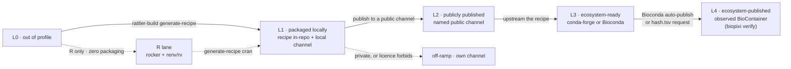

<p align="center">
  
</p>

# biopixi

**Know whether your pixi environment can survive outside its repository — and what to do next.**

pixi is excellent at creating and locking development environments. But a working `pixi.toml`
can still depend on local source paths, unpublished packages, or infrastructure that
collaborators and workflow systems cannot access. A lockfile can precisely describe an
environment while the source or artifacts needed to recreate it remain tied to one checkout.
**Reproducible is not the same as transferable.**

`biopixi grade` examines a manifest without installing or executing anything. It identifies the
dependency that limits portability and reports the next concrete step toward a locally packaged
environment, a community-published conda environment, or a durable BioContainer.

biopixi is for bioinformatics developers who have a working pixi environment and want to know
whether a collaborator, CI runner, workflow engine, Galaxy server, or future maintainer can use
it without access to the original checkout.

The intended interface is:

```console
$ biopixi grade

default: L1 — packaged locally

✓ supported pixi.toml profile
✓ public dependencies are versioned
✓ r-designit has an in-repository recipe
✗ r-designit is not available from a public channel

This environment still depends on the repository.

Next step:
  Publish r-designit to a public conda channel.
  For community maintenance and standard Galaxy tooling, upstream it to
  conda-forge or Bioconda.
```

Underneath that result is a deliberately small conformance profile for `pixi.toml`. pixi is a
large, general tool; biopixi defines the slice that carries a portability guarantee and grades a
manifest against it. Nothing here replaces pixi, conda, rattler-build, mulled, or Wave. biopixi
is metadata and policy that **calls out to those tools**. It never installs anything itself. It
is not a package manager and will never become one.

Two verbs. **`grade`** is non-executing: it reads the manifest and lockfile and checks public
metadata, but invokes no package, recipe, solver, or container tool. It is safe to run in CI or a
pre-commit hook. **`build`** does the heavy lifting and shells out — pixi for environments,
rattler-build for recipes, mulled-build or Wave for containers. Keeping grading toolchain-free
means a contributor can learn where they stand without first assembling a build system.

The through-line is a bridge. pixi covers development and local environments — fast solves, a
real lockfile, task running. mulled and Wave publish and distribute runtime artifacts, but say
nothing about how you work day to day. biopixi is the on-ramp from a working `pixi.toml` to
conda-forge, Bioconda, BioContainers, and the Galaxy tool ecosystem — each step of that journey
named, gradeable, and worth taking on its own.

## Readiness Levels

A manifest earns **L0–L4**. These levels do not measure scientific reproducibility, software
quality, or security. They measure how much project-specific infrastructure must still exist
before an environment can be rebuilt or run elsewhere.

The normative boundary — including the default-environment constraint, platform targets,
dependency forms, channel provenance, and incomplete lockfiles — is defined in
[`PROFILE.md`](PROFILE.md). The current grader is a prototype; the implementation gaps are listed
at the end of that document rather than hidden as implied guarantees here.

L1–L4 intentionally model one runtime environment on required `linux-64`, with optional
`osx-arm64`. Named features, `no-default-feature`, multiple environments, and other platforms are
valid Pixi, but outside this focused Bioconda/BioContainers profile.

L1 requires the original repository and a local build toolchain. L2 removes the repository by
publishing every package to a named public channel. L3 moves those packages into conda-forge or
Bioconda, where they participate in established community build, migration, testing, and
maintenance infrastructure. L4 records that the exact environment has been published as a
BioContainer and distributed through the Galaxy ecosystem, after the environment has satisfied
L3.

Every distinction is mechanically decidable from the manifest, a current resolved lockfile, and
public metadata — no judgement calls. Under the normative profile, a missing or stale lockfile
produces `UNRESOLVED` or `STALE`, with no numeric grade. Manifest inspection can still report
L0 violations and useful ceilings without pretending it has inspected the transitive closure.

| Level  | Name                | Mechanically decidable condition                                                        | What still must exist                                                                     |
| ------ | ------------------- | --------------------------------------------------------------------------------------- | ----------------------------------------------------------------------------------------- |
| **L0** | out of profile      | the manifest uses unsupported constructs, or a local dependency has no usable recipe    | no portability claim is made                                                              |
| **L1** | packaged locally    | each local dependency has an in-repository recipe                                       | this repository, public dependency channels, and a local build toolchain                  |
| **L2** | publicly published  | every package is versioned and obtainable from a named public channel                   | those publishers and explicitly configured channels                                       |
| **L3** | ecosystem-ready     | every package is obtainable from conda-forge or Bioconda                                | the community package ecosystem; recipes participate in its build and migration machinery |
| **L4** | ecosystem-published | L3 holds, and a BioContainer for the exact target set was observed at a public registry | any one supported copy of the pre-built artifact                                          |

At L2, an `environment.yml` is derivable with the required custom channels and container builders
can use those channels explicitly. At L3, the same operations use the standard conda-forge,
Bioconda, mulled, Wave, and Galaxy pathways. L4 removes the build step for consumers: the
pre-built artifact is ready for a container runtime.

Package readiness determines L0–L3: an environment's readiness is the minimum readiness of every
package in its resolved dependency closure. One package on a project channel caps the environment
at L2, even if everything else is in conda-forge or Bioconda.

L4 adds an environment-level condition to the package-level ladder. It is evaluated only after
the full dependency closure has earned L3: an exact BioContainer must then have been published
and observed. Unlike L1–L3, it is **not decidable offline** — nothing in a project records that an
image was built and can be pulled — so `biopixi grade` stops at L3 and reports how far the
container claim got, and `biopixi verify` reaches a registry and records the manifest digest that
earns L4. A container built from a custom public channel does not skip the community
maintenance requirement — it remains L2 even if that historical artifact happens to exist.
Levels are therefore cumulative and **derived, never declared**.



L3 represents biopixi's packaging best practice: dependencies live in community-maintained
channels and participate in their standard infrastructure. L4 represents publication best
practice: a BioContainer for the target environment has actually been built and distributed.
[Bioconda publishes a container alongside each successfully built package](https://bioconda.github.io/contributor/build-system.html);
conda-forge-only and multi-package target sets reach L4 through the BioContainers
[`hash.tsv`](https://github.com/BioContainers/multi-package-containers/blob/master/combinations/hash.tsv)
workflow.

### Executable examples

The examples are real pixi solves and double as grader fixtures:

| Level  | Example                                                                             | What it demonstrates                                                                                                  |
| ------ | ----------------------------------------------------------------------------------- | --------------------------------------------------------------------------------------------------------------------- |
| **L0** | [`l0-out-of-profile`](examples/l0-out-of-profile/)                                  | a valid pixi environment that mixes in PyPI and install-like tasks outside the profile                                |
| **L1** | [`l1-local-recipe`](examples/l1-local-recipe/)                                      | an in-repository `r-designit` recipe and path dependency                                                              |
| **L2** | —                                                                                   | not yet represented by a real solve; it needs a stable package from a public channel outside conda-forge and Bioconda |
| **L3** | [`l3-ecosystem-ready`](examples/l3-ecosystem-ready/)                                | every package is community-maintained, but the exact combination is not published                                     |
| **L4** | [`l4-single`](examples/l4-single/) and [`l4-combination`](examples/l4-combination/) | the two publication routes: an automatic Bioconda image and a registered multi-package image                          |

The L2 branch is covered by a focused unit test, but the example suite deliberately does not
pretend a fabricated lockfile is a real public solve. A durable public-channel fixture is still
needed before all five levels are represented end to end.

## How the container gets made

**L1** — mulled tooling against the local build output. Same machinery BioContainers uses:

```bash
rattler-build build --recipe recipes/r-designit/recipe.yaml   # -> output/
rattler-index fs ./output
mulled-build build -c file://$PWD/output,conda-forge,bioconda 'r-designit=0.5.0'
```

Produces the same `mulled-v2` name a published build would, computable offline. Not pushed
anywhere — and it must not be, see Gotchas.

**L2** — replace the `file://` entry with the named public channel. Anyone with that channel
configuration can reproduce the environment and build a container; the project or channel owner
still carries the packaging and migration burden.

**L3** — conda-forge and Bioconda are standard inputs to the Galaxy container ecosystem. With no
local toolchain at all:

```bash
wave-biopixi --freeze --await
```

For Bioconda packages, the channel build publishes a corresponding BioContainer automatically.
For conda-forge-only or multi-package target sets, add the exact target string to BioContainers'
`hash.tsv`.

**L4** — nothing to build. `docker pull quay.io/biocontainers/mulled-v2-<hash>:<tag>`, or
Singularity from `depot.galaxyproject.org`.

### Wave and mulled are both kept, deliberately

They fail in opposite places. Wave is a hosted service, so it cannot see a `file://` channel and
is blind at L1, but it needs nothing locally beyond one binary. mulled needs conda, Docker, and
involucro on the machine, and builds from any channel including a local one. **Wave for convenient
provisioning, mulled for local builds and the BioContainers path.**

The names differ too. mulled hashes a sorted package set, so one environment has one name and
biopixi can derive it offline. Wave hashes a build request, including fields rendered by the
service, so the same environment spelled two ways gets two names. Container identity in a grade
therefore comes from mulled.

[Working with Pixi environments](docs/guides/working-with-pixi-environments.md) has the practical
comparison and commands. [Container identity internals](docs/architecture/containers.md) explains
the naming and registry logic behind a grade.

## The R lane

R packages absent from conda are not blocked. `rv`/`renv` install natively from CRAN,
Bioconductor, and GitHub, with `rocker/r-ver` or `wave --cran-package` for the container. That
lane trades an offline-derivable container identity for zero packaging work, and converts into L1
whenever `rattler-build generate-recipe cran` is worth running.

**Hard rule:** pin `--cran-base-image rocker/r-ver:<superseded patch>`. The _current_ patch tag
resolves `p3m.dev/.../noble/latest` — a moving repo. Record the resolved snapshot date, not the
tag; the tag's meaning drifts as rocker freezes it once superseded.

## Design rules

- **The profile is declarative metadata pointing at other formats — never a build instruction.**
  A field describing _how_ to install something belongs in a recipe. This is the line that keeps
  biopixi from becoming another packaging format.
- **The artifact must work without us.** A conformant manifest is just a `pixi.toml` — `pixi
install` works with biopixi nowhere in sight. From L2 up, anyone with access to the declared
  channels can build a container using `wave`, `mulled-build`, or a plain Dockerfile. At L3 no
  project-specific channel configuration is needed; at L4 the artifact is already available.
  biopixi grades and automates, but must never become a dependency of the result.
- **`grade` stays non-executing.** No solver, recipe runner, package code, or container tool may
  become a prerequisite for knowing your level. Public claims are accompanied by the metadata
  evidence and observation time that justified them.
- **Levels are derived, never authored.** A manifest cannot declare its own level.
- **L1 is a staging area, not a destination.** Everything technical is available at L1; what
  publication buys is reach, and what upstreaming buys is community infrastructure.

## Gotchas

- **The mulled name does not encode provenance.** It is a function of the target string alone, so
  an L1 local build is name-identical to the official one. Promotion is therefore
  pin-transparent, but **L1 images must never be pushed anywhere public.**
- **Channel prefixes are part of the mulled identity.** `conda-forge::r-designit=0.5.0,...` and
  `r-designit=0.5.0,...` hash to different repository names. Record target strings verbatim.
- **BioContainers is channel-agnostic; the readiness ladder is not.** `hash.tsv` accepts
  `channel::package`, and historical images exist for packages from other public channels. Their
  existence does not confer L4: an environment must first satisfy L3 by resolving its complete
  package closure from conda-forge or Bioconda. L4 does not require a _Bioconda_ package — a
  conda-forge-only combination can qualify — but it does require L3.

## Development

biopixi is a Node.js 22+ pnpm workspace modeled after the package and documentation structure in
`galaxy-tool-util`.

| Package                                   | Responsibility                                              |
| ----------------------------------------- | ----------------------------------------------------------- |
| [`@biopixi/core`](packages/core/)         | offline grading, Conda build planning, and mulled-v2 naming |
| [`@biopixi/cli`](packages/cli/)           | the `biopixi grade` command and terminal rendering          |
| [`@biopixi/wave-cli`](packages/wave-cli/) | the `wave-biopixi` adapter for hosted public-package builds |

```bash
pnpm install
pnpm check
pnpm build
node packages/cli/dist/bin/biopixi.js grade examples/l4-single
node packages/wave-cli/dist/bin/wave-biopixi.js examples/l3-ecosystem-ready --print-command
```

The documentation site is under [`docs/`](docs/) and combines Docsify prose with a generated
TypeDoc API:

```bash
pnpm docs:build
pnpm docs:dev
```

---

_Status: early TypeScript prototype. The profile is normative; implementation gaps are tracked in
[`PROFILE.md`](PROFILE.md)._
