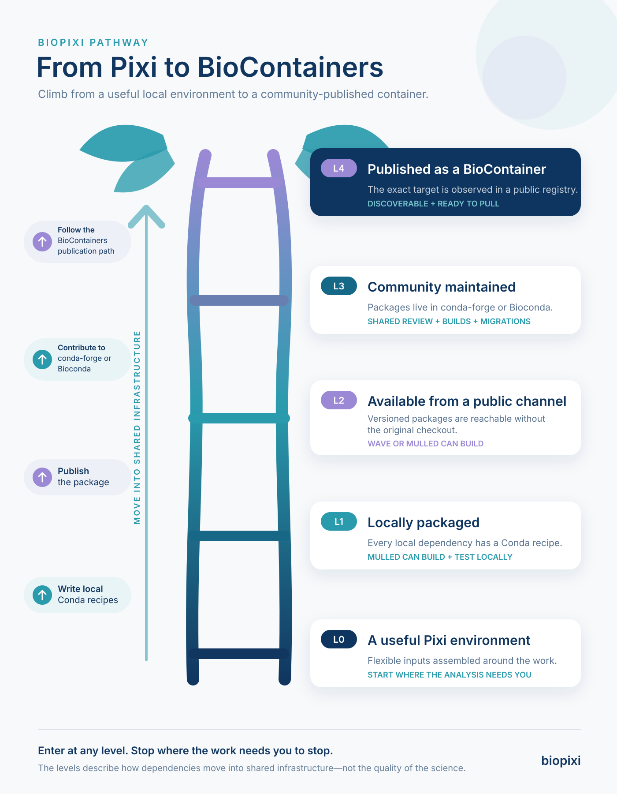

# biopixi

biopixi grades how far a bioinformatics [Pixi](https://pixi.sh) environment can travel beyond its
original project.

A lockfile can be reproducible while still depending on local recipes, private channels, or an
unpublished container target. biopixi names those boundaries as a cumulative L0–L4 readiness
level and identifies the next packaging or publication step.

<figure class="journey-ladder">
  <a href="assets/biopixi-ladder-infographic.svg" target="_blank" rel="noopener">
    
  </a>
  <figcaption>Open the full-size pathway diagram.</figcaption>
</figure>

## Packages

| Package                             | Purpose                                                               |
| ----------------------------------- | --------------------------------------------------------------------- |
| [`@biopixi/core`](packages/core.md) | Offline manifest, lock, channel, and BioContainers grading primitives |
| [`@biopixi/cli`](packages/cli.md)   | The `biopixi grade` command                                           |

## Design boundary

biopixi is not a package manager, solver, or container builder. Grading reads a project manifest,
its lock, and versioned public metadata without installing or executing package code. The
canonical policy is the [normative biopixi profile](profile.md), rendered as part of this
documentation.

## Quick start

```bash
pnpm install
pnpm build
node packages/cli/dist/bin/biopixi.js grade examples/l4-single
```

Continue with [Getting Started](getting-started.md) or read
[How the profile works](architecture/profile.md).
